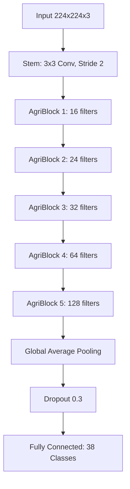

# AgriVision 2.0: Major Project Technical Approach

This plan outlines the transition from a minor project (Fine-tuned EfficientNet) to a major project featuring a **custom-built architecture**, expanded intelligence capabilities, and a premium full-stack ecosystem.

## 🏗️ ML Architecture: "AgriNet" (Custom CNN)

To satisfy the "from scratch" requirement while maintaining high performance, we will use a **BottleNeck-based CNN** architecture.

### Core Architecture Concept
Instead of standard convolutions, use **Inverted Residual Blocks** (similar to MobileNetV2) but implemented manually. This shows a deep understanding of modern CNN optimizations.

### Technical Specs
- **Depthwise Separable Convolutions**: Reduces parameters while maintaining spatial feature extraction.
- **Squeeze-and-Excitation (SE) Blocks**: Dynamically recalibrates channel-wise feature responses (Huge impact on accuracy for "Major" projects).
- **Custom Loss Function**: Label Smoothing CrossEntropy to handle noisy leaf images.

## 📊 Dataset Expansion Strategy

Moving beyond the clean "laboratory" images of PlantVillage is critical for real-world robustness.

1.  **Base Dataset**: PlantVillage (70k images, 38 classes).
2.  **Field Expansion**: Integrate **PlantDoc** dataset (~2,600 images). These are "internet-scraped" field images with complex backgrounds.
3.  **Data Augmentation 2.0**:
    - **CutMix/MixUp**: Advanced techniques to help the model distinguish overlapping leaves.
    - **Environmental Simulation**: Randomly vary brightness/contrast to simulate different times of day in the field.

## 🧠 Advanced Intelligence Features

### 1. Explainable AI (XAI) with Grad-CAM
Implement **Grad-CAM** to generate heatmaps. This shows the farmer *why* the model made a prediction by highlighting the infected areas on the leaf.

### 2. Disease Severity Estimation
Add a second output head to the model (Dual-Task Learning):
- **Head A**: Classification (What disease?)
- **Head B**: Severity Score (0-100% or Low/Medium/High).

### 3. Real RAG (Retrieval-Augmented Generation)
Move from basic AI chatting to a **Knowledge-Grounded** system.
- **Data Source**: Agricultural PDFs, treatment manuals, and disease research papers.
- **Tech Stack**: 
  - **Vector DB**: `FAISS` (Facebook AI Similarity Search) for local, lightning-fast retrieval.
  - **Embeddings**: `sentence-transformers/all-MiniLM-L6-v2` for converting text to vectors.
  - **Orchestration**: `LangChain` to link Retrieval -> Context -> LLM Prompt.
- **Workflow**: 
  1. User asks a question about a disease.
  2. System searches the Vector DB for the most relevant treatment chunks.
  3. Context is injected into the LLM (Perplexity/Llama) to provide a "Verified" answer.

## 💻 Full-Stack Ecosystem Upgrade

### Backend (FastAPI + PostgreSQL)
- **Database Architecture**: Move from JSON/In-memory to **PostgreSQL**.
  - `users` table: Authentication and profile.
  - `predictions` table: Linked to users, stores image URL, results, and location.
- **Asynchronous Task Queue**: Use **Celery/Redis** for processing heavy image tasks or generating PDF reports.

### Frontend (Next.js + Framer Motion)
- **Glassmorphism UI**: Use semi-transparent layouts with vibrant agricultural colors (Emerald, Earthy Gold).
- **Interactive Dashboard**: Graphs showing common diseases in the user's "region" based on aggregate history.
- **PDF Report Generator**: Create professional diagnosis reports including the Grad-CAM heatmap.

## 🧪 Verification & Graduation Plan
1.  **Benchmarking**: Compare AgriNet vs. the old EfficientNet-B0.
2.  **Robustness Test**: Test with blurry/low-light images to prove "Major Project" quality.
3.  **Academic Documentation**: A 50+ page report template focusing on architecture design and ablation studies.
